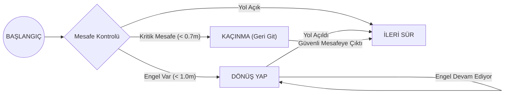
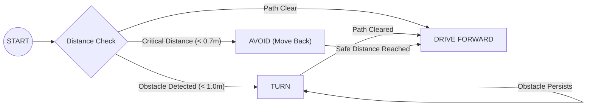

<br />
<div align="center">
  <h3 align="center">Basit Otonom Sürüş: Engelden Kaçma / Duvar İzleme</h3>

  <p align="center">
    ROS ve Lidar Sensörü Kullanarak FSM Tabanlı Otonom Navigasyon
    <br />
    <br />
  </p>
</div>

<div align="center">
  
  
  
</div>

<br/>

<details>
  <summary>📝 İçindekiler (TR)</summary>
  <ol>
    <li>
      <a href="#proje-hakkında">Proje Hakkında</a>
      <ul>
        <li><a href="#fsm-yapısı">FSM Yapısı</a></li>
        <li><a href="#kullanılan-topicler">Kullanılan Topic'ler</a></li>
      </ul>
    </li>
    <li>
      <a href="#kurulum-ve-çalıştırma">Kurulum ve Çalıştırma</a>
    </li>
    <li><a href="#kullanılan-parametreler">Kullanılan Parametreler</a></li>
  </ol>
</details>

---

## Proje Hakkında

Bu proje, bir mobil robotun (TurtleBot) kapalı bir parkurda engellere çarpmadan ilerlemesini sağlayan otonom bir ROS düğümü (node) içerir. 

Proje, **Sonlu Durum Makinesi (Finite State Machine - FSM)** mimarisi üzerine kurulmuştur. Robot, LIDAR sensöründen (`/scan`) gelen verileri işleyerek çevresindeki engelleri algılar ve duruma göre hareket kararı verir.

### FSM Yapısı

Robotun davranış mantığı aşağıdaki durum diyagramında gösterilmiştir:



### Kullanılan Topic'ler

Robotun sensör verilerini okumak ve hareket komutları göndermek için kullandığı ROS topicleri şunlardır:

| Topic Adı | Mesaj Tipi | Açıklama |
| :--- | :--- | :--- |
| `/scan` | `sensor_msgs/LaserScan` | Lidar sensöründen gelen mesafe verileri |
| `/mobile_base/commands/velocity` | `geometry_msgs/Twist` | Robota gönderilen hız komutları |
| `~state` | `std_msgs/String` | Debug amaçlı anlık FSM durumu yayını |

---

## Kurulum ve Çalıştırma

Bu projeyi yerel ortamınızda çalıştırmak için aşağıdaki adımları izleyin.

### 1. Gereksinimler
* ROS (Melodic veya Noetic)
* Python 3
* `geometry_msgs`, `sensor_msgs` paketleri

### 2. İndirme ve Derleme

```bash
cd ~/catkin_ws/src
git clone [https://github.com/AlperenER/simple_autonomous_driving.git](https://github.com/AlperenER/simple_autonomous_driving.git)
cd ..
catkin_make
source devel/setup.bash
```

### 3. Simülasyonu veya Robotu Başlatma

Önce robotun temel sürücülerini ve lidar sensörünü başlatın:

```bash
roslaunch turtlebot_bringup minimal.launch
roslaunch rplidar_ros test_rplidar.launch
```

### 4. Otonom Düğümü Çalıştırma

Görevi başlatmak için oluşturulan Python scriptini çalıştırın:

```bash
rosrun simple_autonomous_driving gorev1_fsm_node.py
```

---

## Kullanılan Parametreler

Robotun davranışını değiştirmek için kod içerisindeki aşağıdaki değişkenler düzenlenebilir:

| Değişken | Değer | Açıklama |
| :--- | :--- | :--- |
| `forward_speed` | 0.15 | Robotun düz sürüş hızı (m/s) |
| `turn_speed` | 0.45 | Dönüş hızı (rad/s) |
| `obstacle_dist` | 1.0 | Engel algılama mesafesi (metre) |
| `critical_dist` | 0.7 | Acil durum kaçınma mesafesi (metre) |
| `blind_spot` | 0.15 | Sensör kör nokta filtresi |

---

<div align="center">
  <p><b>Alperen ER</b></p>
  <p>
    <a href="https://github.com/AlperenER">
      
    </a>
  </p>
</div>

<br />
<br />
<br />

---
<div align="center">
  <h1>🇬🇧 English Description</h1>
</div>
---

<div align="center">
  <h3 align="center">Simple Autonomous Driving: Obstacle Avoidance / Wall Following</h3>

  <p align="center">
    FSM Based Autonomous Navigation Using ROS and Lidar Sensor
    <br />
    <br />
  </p>
</div>

<details>
  <summary>📝 Table of Contents (EN)</summary>
  <ol>
    <li>
      <a href="#about-the-project">About the Project</a>
      <ul>
        <li><a href="#fsm-structure">FSM Structure</a></li>
        <li><a href="#topics-used">Topics Used</a></li>
      </ul>
    </li>
    <li>
      <a href="#installation-and-execution">Installation and Execution</a>
    </li>
    <li><a href="#parameters-used">Parameters Used</a></li>
  </ol>
</details>

---

## About the Project

This project contains an autonomous ROS node that enables a mobile robot (TurtleBot) to move in a closed course without hitting obstacles.

The project is built on the **Finite State Machine (FSM)** architecture. The robot processes data from the LIDAR sensor (`/scan`) to detect surrounding obstacles and decides on movement accordingly.

### FSM Structure

The logic of the robot's behavior is shown in the state diagram below:



### Topics Used

The ROS topics used by the robot to read sensor data and send motion commands are as follows:

| Topic Name | Message Type | Description |
| :--- | :--- | :--- |
| `/scan` | `sensor_msgs/LaserScan` | Distance data from Lidar sensor |
| `/mobile_base/commands/velocity` | `geometry_msgs/Twist` | Velocity commands sent to the robot |
| `~state` | `std_msgs/String` | Instant FSM state publishing for debugging |

---

## Installation and Execution

Follow the steps below to run this project in your local environment.

### 1. Requirements
* ROS (Melodic or Noetic)
* Python 3
* `geometry_msgs`, `sensor_msgs` packages

### 2. Download and Compile

```bash
cd ~/catkin_ws/src
git clone [https://github.com/AlperenER/simple_autonomous_driving.git](https://github.com/AlperenER/simple_autonomous_driving.git)
cd ..
catkin_make
source devel/setup.bash
```

### 3. Starting Simulation or Robot

First, start the robot's basic drivers and lidar sensor:

```bash
roslaunch turtlebot_bringup minimal.launch
roslaunch rplidar_ros test_rplidar.launch
```

### 4. Running the Autonomous Node

Run the created Python script to start the task:

```bash
rosrun simple_autonomous_driving gorev1_fsm_node.py
```

---

## Parameters Used

The following variables in the code can be edited to change the robot's behavior:

| Variable | Value | Description |
| :--- | :--- | :--- |
| `forward_speed` | 0.15 | Robot forward driving speed (m/s) |
| `turn_speed` | 0.45 | Turning speed (rad/s) |
| `obstacle_dist` | 1.0 | Obstacle detection distance (meter) |
| `critical_dist` | 0.7 | Emergency avoidance distance (meter) |
| `blind_spot` | 0.15 | Sensor blind spot filter |

---

<div align="center">
  <p><b>Alperen ER</b></p>
  <p>
    <a href="https://github.com/AlperenER">
      
    </a>
  </p>
</div>
```
